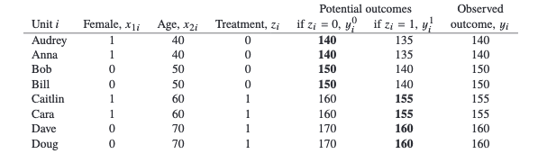
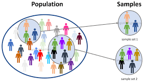
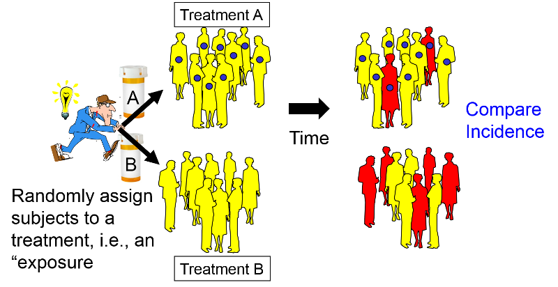
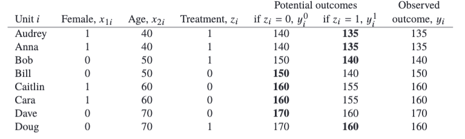

class: center, middle

<div style="text-align: justify">

```{r setup, echo=FALSE}
#options(htmltools.dir.version = FALSE)

library(xaringanExtra)

xaringanExtra::use_logo(
  image_url = "http://escolar.itam.mx/centro_tesis/img/logo-ITAM.png",
  position = xaringanExtra::css_position(top = "1em", right = "1em")
)

xaringanExtra::use_broadcast()

xaringanExtra::use_panelset()
xaringanExtra::style_panelset_tabs(
  active_foreground = "#061b94",
  hover_foreground = "#000000",
  font_family = "Roboto"
)
```

# Objetivo

El objetivo de este capítulo es conocer las principales definiciones y problemáticas asociados a los diseños de experimentos que pretenden inferir el efecto asociado a un tratamiento o exposición aplicado a un individuo. 

A lo largo del capítulo se analizan diferentes problemas junto con sus respectivas hipótesis y propuestas de solución.

---
class: inverse, center, middle

# Capítulo 18.1

## Bases de la inferencia causal

---

## Bases de inferencia causal

<div style="text-align: justify">

Los efectos causales se conceptualizan como una comparación entre los diferentes resultados potenciales y los resultados que podría haber sucedido en otros escenarios. (Estado fáctico / Estados contrafácticos)

**Ejemplo:** Tomemos el efecto en el consumo de ácidos grasos omega-3, como una estrategía eficaz para abordar una afeción médica como es la presión arterial sistólica (presión máxima que ejerce el corazón mientras late), en este caso se considera ***presión arterial alta*** niveles de $160mmHG$ o superiores.

```{r, fig.align='center', out.height='220', out.width='450', echo=F}

```

???
Asumimos que los individuos siguen el tratamiento asignado. Al final del periodo se miden las presiones arteriales de los participantes.

---

## Resultados potenciales, contractuales y efectos causales

Resultados potenciales de la presión arterial: 

| $y_{i}^0$                            | $y_{i}^1$                     |
|--------------------------------------|-------------------------------|
| <span style="font-size:16px">La persona no tomó ningún suplemento</span> | <span style="font-size:16px">La persona tomó el suplemento</span> |

Para este experimento consideramos los siguientes estados:

| **Estado fáctico**                   | **Estado contrafractual**            |
|--------------------------------------|--------------------------------------|
| $y_{i}^1$ <span style="font-size:14px">recibio el tratamiento</span>    | $y_{i}^0$ <span style="font-size:14px">recibio el tratamiento</span> |
| $y_{i}^0$ <span style="font-size:14px">no recibio el tratamiento</span> | $y_{i}^1$ <span style="font-size:14px">no recibio el tratamiento</span> |

El efecto causal puede expresarse como: 

$$\tau_i = y_{i}^1 − y_{i}^0$$

???
La diferencia de lo que hubiera ocurrido cuando se toma el tratamiento en comparación cuando no se toma el tratamiento sse llama el efecto del tratamiento y por tanto sería la inferencia causal.

---
<div style="text-align: justify">
</br>
</br>
Supongamos que un individuo $j^{th}$ antes del tratamiento tiene una presión de $140mmHg$, recibe suplementos, y al termino su medición fue de $y_{j}^1 = 135mmHg$. ¿Este descenso proporciona evidencia suficiente de que los suplementos causan una reducción en la presión arterial? 

## El problema fundamental de la inferencia causal

El problema inherente de la inferencia causal es que nunca podemos observar los resultados potenciales $y_{j}^0$ y $y_{j}^1$ al mismo tiempo. 

## Sustitutos próximos

¿Qué pasaría si tuviéramos la presión arterial de individuo antes del estudio? ¿Podríamos usar eso como un sustituto de su $y_{j}^0?$ 

Comenzamos a plantear escenarios:

- ¿Nos puede ayudar la idea básica detrás de un diseño de estudio antes vs después?

???
La única forma en que podríamos hacer esta afirmación sería si supiéramos que si Audrey no hubiera recibido los suplementos, entonces su presión arterial habría sido más alta, o hubiera permanecido igual. Sin, embargo esto no lo podemos saber.

- El problema fundamental de la inferencia causal
No podemos observar la presión sanguínea que habría resultado tanto si Audrey hubiera tomado los suplementos como si no, por lo que el efecto causal es imposible de medir directamente. Esto se conoce comúnmente como el problema fundamental de la inferencia causal.

Si los tratamientos se asignaran al azar, podemos estimar un efecto causal promedio, pero no nos informará sobre el efecto en una persona determinada. Estos esfuerzos de definir y estimar efectos causales promedio, solo podrían aplicar directamente a los individuos si estamos dispuestos a asumir que los efectos son constantes entre las personas. Una razón por la que puede ser importante incluir interacciones de tratamiento en modelos de regresión causal es porque esta es una forma de estimar la variación en los efectos.

- Sustituos proximos
El problema es que la presión arterial de Audrey antes de que comience el estudio, $y_{j}^{before}$, no es necesariamente un reflejo éxacto de cuál sería su presión arterial sin los suplementos un año después, haciendo $y_{j}^{before}$ lo que la convierte en un pobre sustituto de $y_{j}^{0}$.

Las cosas se complicarían aún más si el estudio se implementara de modo que Audrey recibiera los complementos en el primer año pero no en el segundo. Si los suplementos resultaran tener un efecto de larga duración, los resultados del segundo año se verían afectados por el tratamiento del primer año. Podríamos intentar evitar esta contaminación permitiendo un período de depuración(limpieza) entre los segmentos del estudio (en nuestro ejemplo para intentar asegurarnos de que el cuerpo ya no se vea afectado por los suplementos), pero este diseño todavía adolece del defecto de intentar implícitamente sustituir mediciones de un período como estimaciones de resultados potenciales de otro. 

---
class: inverse, center, middle

# Capítulo 18.2

## Efectos Causales Promedio

---

## Efectos causales promedio

<div style="text-align: justify">

El contra-factual o resultado potencial añade claridad al significado de efectos causales, pero también resalta el desafío inherente en su estimación. 

En experimentos en la cuales solo un tratamiento es aplicado a cada individuo, no será posible estimar el efecto causal a **nivel individuo**, $y^1_i − y^0_i$.

```{r, fig.align='center', out.height='300', out.width='600', echo=F}

```


---
## ¿Qué hacemos?

Supongamos que los individuos pueden aplicar a ambos estudios tratamiento y 
control, es decir, se tiene $y^1_i, y^0_i$ para cada individuo. 

Dados estos dos resultados potenciales se puede obtener el efecto del tratamiento 
de cada individuo.

$$\tau_i = y^1_i − y^0_i$$
**Por ejemplo:**

.pull-left[
```{r, fig.align='center', out.height='150', out.width='500', echo=F}

```
]
.pull-right[

Existen diferencias entre los grupos de tratamiento y de control por lo que se 
deben de realizar ciertos ajustes para estimar el efecto causal. 
 
El efecto causal $\tau_i$ puede variar de persona en persona; es por eso que el
cálculo de éste dependerá de en qué grupo de personas se está promediando este
efecto.
]

???

Consideremos de nuevo nuestra hipótesis de 8 personas en el estudio. Suponga que la figura 18.2 fue mostrada por los datos que pudieron haberse visto si fuéramos capaces de aplicar tanto el tratamiento como el control a cada persona. 

Bajo este estado de omnisciencia, podríamos ver tanto $y^1$ y $y^0$ para cada participante en el estudio. Dados todos estos posibles resultados, podemos directamente calcular el efecto del tratamiento para cada persona:

---

## Efectos medios del tratamiento 

.panelset[
.panel[.panel-name[SATE]

#### Sample Average Treatment Effect

Este estimado, llamado **Efecto promedio de tratamiento muestra** o SATE, puede ser calculado al promediar todos los $y_i^1$ y sustraer el promedio de los $y^0_i$ en al muestra. Equivalentemente y quizá más intuitivamente, podemos simplemente promediar los efectos causales a nivel individual.

$$\tau_{SATE}=\frac{1}{n} \sum_{i=1}^n(y_i^1 - y_i^0)$$
```{r, fig.align='center', out.height='150', out.width='300', echo=F}

```

]

.panel[.panel-name[CATE]

#### Conditional Average Treatment Effect

Este estimador se calcula para subconjuntos definidos de la muesta, por ejemplo, 
por edad, por género, etc. 

Estos estimadores condicionales pueden tomar formas complicadas como las
predicciones de los modelos de regresión lineal.

```{r, fig.align='center', out.height='250', out.width='400', echo=F}

```

]

.panel[.panel-name[PATE]

#### Population Average Treatment Effect

<div style="text-align: justify">

El efecto de tratamiento promedio de tratamiento popular es a menudo una meta en la inferencia causal. Para una población de tamaño N, podemos definir el *PATE* como:

$$\tau_{PATE} = \frac{1}{N} \sum_{i=1}^n(y_i^1 - y_i^0)$$
En este problema de inferencia, hay dos tipos de datos faltantes:

1. Los valores contractuales faltantes dentro de nuestra muestra
2. Ambos resultados potenciales para aquellas observaciones que no están en la muestra.

]
]

???

Los investigadores a menudo quieren inferir acerca de alguna población de interés en vez de simplemente estudiar una muestra. Realísticamente, las personas que forman parte de un experimento social o médico no son obtenidos de manera aleatoria o representativa de una población.

Mientras mejor esté hecha la muestra para hacer inferencias causales, esta se vuelve menos representativa de la población conocida.

Para conocer el PATE, nuestra omnisciencia necesitaría extenderse para ver ambos resultados potenciales de la completa población de interés

---

#### Population Average Treatment Effect

<div style="text-align: justify">

Si la muestra de estudio es aleatoria entonces cualquier estimador insesgado de 
**SATE** será estimador insesgado de **PATE**. Más aún, cuando se ajustan modelos 
de regresión, el estimador **PATE** dependerá de la distribución asumida de los 
predictores en la población de interés.

Por ejemplo, si el efecto del tratamiento estimado es mayor para las mujeres que 
para los hombres entonces el estimador **PATE** dependerá de la proporción de 
hombres y mujeres de la población de interés. 

Si la muestra no es aleatoria, estimar **PATE** requiere un modelo del efecto del 
tratamiento dados los predictores previos al tratamiento que nos permitan extrapolar
de unidades experimentales a la población general. 

---

### Problemas de autoselección en grupos de tratamiento.

<div style="text-align: justify">

El punto inicial es la comparación de los grupos de tratamiento y control, y podemos correr en problemas si estos dos grupos no son suficientemente similares o balanceados. En el ejemplo propuesto, vemos que la gente que recibió el tratamiento fueron en promedio mayores que los del grupo de control.

Los resultados potenciales encapsulan toda la información necesaria con respecto a lo que necesitamos para que ésta información sea similar en ambos grupos.
Dado que no podemos ajustar los datos directamente, utilizamos nuestras variables de pre-tratamiento como sustitutos. 

```{r, fig.align='center', out.height='250', out.width='400', echo=F}

```

???

Esta diferencia pudo haber ocurrido solo por azar o quizá porque aquellos que accedieron a tomar los suplementos estaban más conscientes sobre su presión sanguínea y el estudio ofreció la oportunidad de probar estos suplementos de manera gratuita, mientras que aquellos que accedieron a estar en el grupo de no suplementos, no le importaba si los suplementos podrían beneficiar su salud.

Aunque se tengan la misma cantidad de hombres y mujeres en ambos
grupos, los individuos que se encuentran en el grupo de control son más jóvenes que 
los individuos que se encuentran en el grupo de tratamiento. Esta inferencia de
edad se debe tomar en cuenta debido a que la edad también influye en el resultado.

---

### Como abordar el desbalance entre los grupos de tratamiento y control

<div style="text-align: justify">

Existen enfoque estadísticos que nos ayudan a asegurar el balance entre los grupos 
de control y tratamiento. 

* **Etapa de diseño:** Se utiliza **aleatorización** para asegurar balance entre ambos grupos. Y se utiliza el **bloqueo/estratificación** para reducir la variación en cualquier desbalance. 

* **Etapa de análisis:** Se pueden **ajustar** para que las variables previas al tratamiento corrijan las diferencias entre los dos grupos para reducir sesgos en la estimación. 

```{r, fig.align='center', out.height='250', out.width='400', echo=F}

```

---
class: inverse, center, middle

# Capítulo 18.3

## Experimentos Aleatorizados

---

</br>

## Experimentos Aleatorizados

<div style="text-align: justify">

La asignación aleatoria de unidades a los grupos de tratamiento y control asegura que no haya diferencias en la esperanza en la distribución de los resultados potenciales entre los grupos. Es posible asignar aleatoriamente unidades a los tratamientos (o tratamientos a las unidades) lanzando una moneda, sacando nombres de un sombrero o, de manera más general, asignando números aleatorios a las unidades. Hoy en día nos apoyamos de software para estas asignaciones aleatoria. 

Ejemplo:

```{r}
sample(c(0,0,0,0,1,1,1,1), 8)
```

---

### Experimentos completamente aleatorizados 

<div style="text-align: justify">

En un experimento completamente aleatorizado, la probabilidad de ser asignado al tratamiento es la misma para cada unidad de la muestra.

</br>

**Resultado idealizado de un experimento completamente aleatorizado.** 

En la tabla anterior la asignación de tratamiento y el resultado observado reflejan una asignación aleatoria idealizada. Caracterizamos la asignación aleatoria como idealizada porque parece haber conducido a distribuciones perfectamente equilibradas de resultados potenciales. En este caso, dado el equilibrio perfecto entre los grupos, tiene sentido que una simple diferencia en medias recupere exactamente el verdadero efecto del tratamiento de −7,5. De manera equivalente, el efecto causal promedio del tratamiento corresponde al coeficienteτ en la regresión, $y_i = \alpha + \tau z_i + error_i$, por lo que podemos estimar el efecto del tratamiento usando una regresión del resultado en la asignación del tratamiento.

---

**Un resultado menos idealizado y aleatorizado.**

<div style="text-align: justify">

Consideremos la siguiente tabla. En este caso, la asignación aleatoria condujo a un desequilibrio entre los grupos de tratamiento y control, con los participantes más jóvenes con más probabilidades de haber recibido tratamiento. Si observamos las $y_i^0$'s notamos que incluso si el tratamiento no tuviera ningún efecto, veríamos una gran diferencia entre los grupos de tratamiento y control en el resultado. Para esta asignación de tratamiento en particular, la diferencia simple entre el tratamiento promedio y las mediciones de control llega a -17.5, que esta bastante alejado del efecto de tratamiento promedio de la muestra real de −7,5. La aleatorización garantiza el equilibrio en promedio, pero no en una muestra cualquiera, y el desequilibrio puede ser grande cuando el tamaño de la muestra es pequeño.

```{r, fig.align='center', out.height='250', out.width='800', echo=F}

```

---

class: inverse, center, middle

# Capítulo 18.4

## Distribuciones muestrales, distribuciones aleatorizadas, y sesgo en la estimación

---


